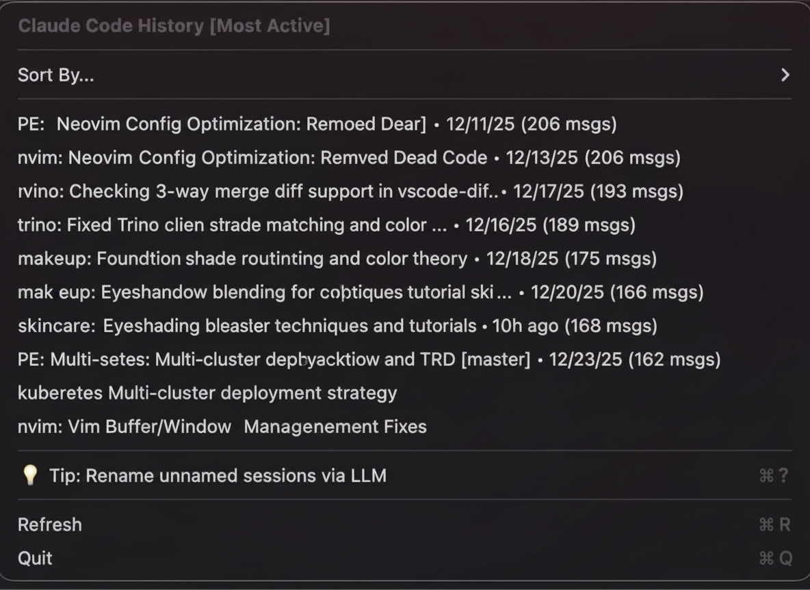

# CCHistory

<div align="center">
  
</div>

A macOS menu bar application that displays your Claude Code conversation history locally. No server, no tracking—just quick access to your sessions.

<div align="center">
  
</div>

## Features

- Menu bar icon showing all Claude Code sessions
- Smart sorting: Most Active, Most Recent, Last Hour/24H/Week, All Time
- Displays repo name, git branch, timestamp, and message count per session
- One-click resume command to clipboard (`Cmd+R` to refresh)
- 100% local—no external communication

## Requirements

- macOS 13.0+
- Claude Code installed with history in `~/.claude/`

## Installation

### Download (Recommended)

Grab the latest `CCHistory.zip` from [Releases](https://github.com/tuannvm/cchistory/releases), extract, and move to Applications.

### Build from Source

```bash
git clone https://github.com/tuannvm/cchistory.git
cd cchistory
export DEVELOPER_IDENTITY="<your-certificate-identity>"
./build.sh
```

Find your identity with: `security find-identity -v -p codesigning`

## Usage

1. Launch `CCHistory.app`
2. Click menu bar icon to view sessions
3. Select sort option from menu or use `Cmd+1` through `Cmd+6`
4. Click session to copy resume command, then paste in terminal

## Privacy

- No external communication
- No analytics or telemetry
- Read-only access to Claude Code history
- No credentials or API keys accessed

## Development

See [docs/development.md](docs/development.md) for build instructions, project structure, and technical details.

## Troubleshooting

See [docs/troubleshooting.md](docs/troubleshooting.md) for common issues.

## License

MIT - see [LICENSE](LICENSE)

## Credits

Inspired by [claude-run](https://github.com/kamranahmedse/claude-run)
