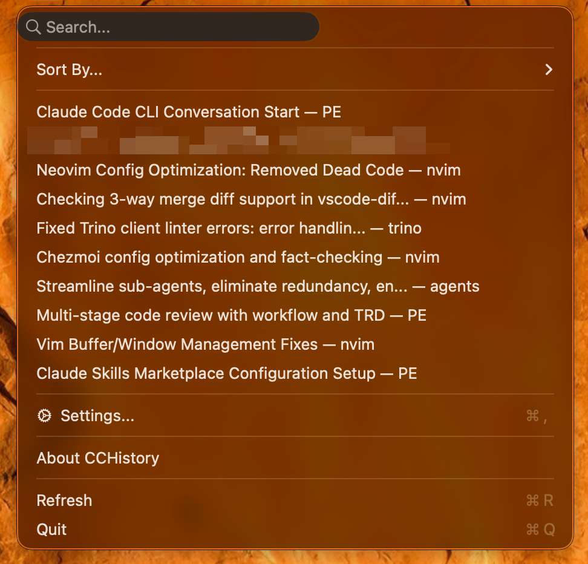

# CCHistory

[](https://swift.org)
[](https://www.apple.com/macos)
[](LICENSE)
[](https://github.com/tuannvm/cchistory/releases)

<p align="center">
  
</p>

A macOS menu bar application that displays your Claude Code conversation history locally. No server, no tracking - just quick access to your sessions.

<p align="center">
  
</p>

## Features

- Menu bar icon showing all Claude Code sessions
- **Search across sessions** - find by name, project, branch, or message content
- **Instant launch with async loading** - no UI blocking while parsing sessions
- Smart sorting: Most Active, Most Recent, Last Hour/24H/Week, All Time
- Displays repo name, git branch, timestamp, and message count per session
- One-click resume command to clipboard (`Cmd+R` to refresh)
- **Settings** - configure custom Claude projects directory (`Cmd+,`)
- Visual copy feedback with checkmark confirmation
- About dialog with version info
- 100% local - no external communication

## Requirements

- macOS 13.0+
- Claude Code installed with history in `~/.claude/`

## Installation

### Download (Recommended)

Grab the latest `CCHistory.zip` from [Releases](https://github.com/tuannvm/cchistory/releases), extract, and move to Applications.

### Build from Source

```bash
git clone https://github.com/tuannvm/cchistory.git
cd cchistory

# Using Makefile (recommended)
make build

# Or using the build script
export DEVELOPER_IDENTITY="<your-certificate-identity>"
./build.sh
```

Find your code signing identity with: `security find-identity -v -p codesigning`

**Available Makefile targets:**
- `make build` - Build and sign app bundle
- `make lint` - Run Swift formatting checks
- `make test` - Run tests
- `make notarize` - Build, sign, and notarize app for Gatekeeper
- `make release` - Create new GitHub release (version bump + notarize + upload)
- `make clean` - Remove build artifacts
- `make run` - Build and run the application
- `make help` - Show all available targets

## Usage

1. Launch `CCHistory.app`
2. Click menu bar icon to view sessions
3. **Search**: Type in the search field to filter by name, project, branch, or content (press ESC to clear)
4. **Sort**: Select sort option from menu or use `Cmd+1` through `Cmd+6`
5. **Settings**: Press `Cmd+,` to configure custom Claude directory
6. Click session to copy resume command, then paste in terminal
7. **Refresh**: Press `Cmd+R` to reload sessions

## Privacy

- No external communication
- No analytics or telemetry
- Read-only access to Claude Code history
- No credentials or API keys accessed

## Development

See [docs/development.md](docs/development.md) for build instructions, project structure, and technical details.

## Troubleshooting

See [docs/troubleshooting.md](docs/troubleshooting.md) for common issues.

## License

MIT - see [LICENSE](LICENSE)

## Credits

Inspired by [claude-run](https://github.com/kamranahmedse/claude-run)
